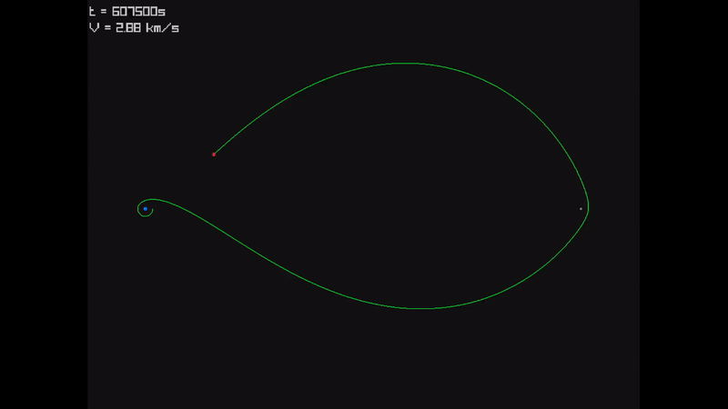

# tiny-kepler



A single-header orbital mechanics and restricted 3-body problem (CR3BP) engine written in C. Includes a custom mission-description DSL parser, RK4 and Verlet integrators, and an event trigger system with GPU-accelerated Zero-Velocity Curve (Jacobi region) visualization.

## Features

- **Custom Domain-Specific Language (DSL):** Define complex astrodynamics missions, target bodies, and event triggers using a custom-built lexer and parser.
- **High-Precision Integrators:** Built-in 4th-order Runge-Kutta (RK4) and Verlet integrators for stable, long-term orbital propagation.
- **Event System:** Dynamically trigger maneuvers, rendering changes, or simulation termination based on spatial boundaries or time steps.
- **GPU-Accelerated Analytics:** Real-time computation of Zero-Velocity Curves (Jacobi constants) using custom GLSL fragment shaders for infinite-resolution boundary visualization at 60 FPS.


## Getting Started

This project relies on Git submodules for its dependencies (`tinyla` and `raylib`). Make sure to clone the repository recursively:

```bash
git clone --recursive git@github.com:marciorvneto/tiny-kepler.git
cd tiny-kepler
```

If you already cloned it without the submodules, you can fetch them by running:

```bash
git submodule update --init --recursive
```

## Building

The project uses a standard Makefile. Build artifacts are placed in the `./out` directory.

To build the CLI examples:

```bash
make
```

To build the graphical orbit viewer (note: this will compile `raylib` from source the first time you run it, which may take a minute):

```bash
make viewer
```

To clean the build directory:

```bash
make clean
```

## Mission DSL

Missions are defined in a custom domain-specific language (DSL). Its syntax is shown below.

```mission
SIM_TYPE     CR3BP
SIM_TIME     1200000
SIM_DT       50
INTEGRATOR   RK4
SHOW_JACOBI

ENTITIES
BODY 1 Earth 5.972e24 6378
BODY 2 Moon  7.348e22 1737.4 384400

INITIAL_STATE
POS 0 6578 0 0
VEL 0 CIRCULAR(0, 1)

EVENTS
AT   START                               DRAW    LAGRANGE_POINTS(1,2)
AT   3420                                MANEUVER DELTA_V 3.09729 PROGRADE
WHEN SPACECRAFT_WITHIN_DIST(1, 6478)     ONCE    END_SIMULATION
```

_At the moment, only Circular Restricted 3-Body Problem (CR3BP) simulations are available._

## Running

Once compiled, you can run the binaries from the `out/` directory.

You can parse a mission file and compute the trajectory, optionally specifying an output `.out` file:

```bash
./out/mission_parser examples/missions/cr3bp-jacobi.mission jacobi.out
```

Then, run the graphical visualizer to watch the simulation using your generated results:

```bash
./out/orbit-viewer jacobi.out
```

_(Note: If no arguments are provided, the parser outputs to `./results.out` and the viewer attempts to read from `./results.out`)_

**Pro-tip:** You can chain the build, parse, and view commands for a seamless workflow:

```bash
make && ./out/mission_parser ./examples/missions/cr3bp-jacobi.mission jacobi.out && make viewer && ./out/orbit-viewer jacobi.out
```

### Viewer Controls

- **Arrow Keys:** Pan the camera
- **Mouse Wheel** or **+ / -**: Zoom in and out
- **J:** Toggle GPU-accelerated Jacobi region visualization

## Project Structure

- `tiny-kepler.h`: The core single-header physics engine, integrator, and parser.
- `examples/`: Example applications, including the Raylib visualizer and basic orbital mechanics tests.
- `examples/missions/`: Sample `.mission` files written in the custom domain-specific language.
- `examples/shaders/`: GLSL Fragment shaders for GPU-accelerated math rendering.
- `test-scripts/`: Python scripts for external plotting and testing.
- `vendor/`: Third-party dependencies (`tinyla` and `raylib`).
