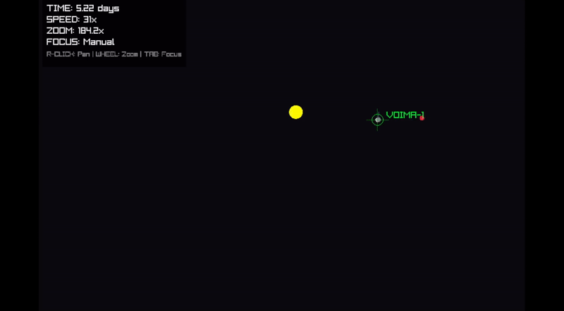
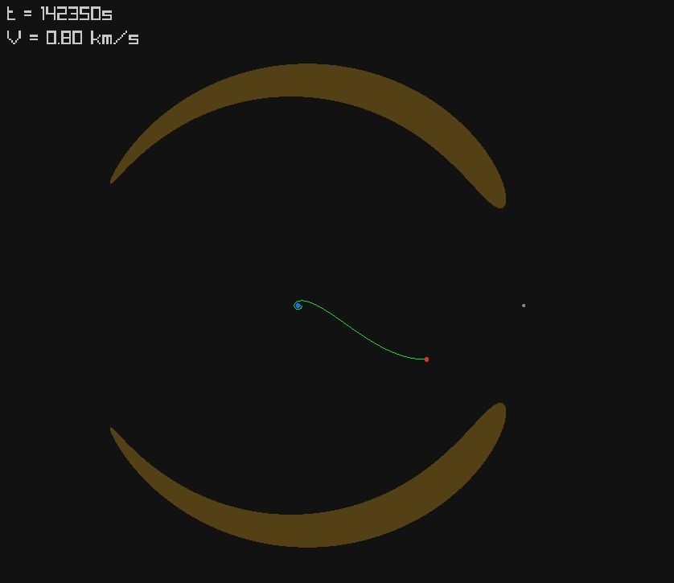

# tiny-kepler



A high-performance, single-header orbital mechanics and trajectory optimization engine written in C.

`tiny-kepler` features a general N-body physics engine, restricted 3-body problem (CR3BP) solvers, and a custom **Sequential Quadratic Programming (SQP) optimal control solver** built from scratch to calculate interplanetary transfers. It includes a custom mission-description DSL parser, high-precision RK4 integrators, and GPU-accelerated Zero-Velocity Curve (Jacobi region) visualization.


## Features

- **Optimal Control Engine:** Includes a custom SQP solver with Powell-damped BFGS Hessian updates, backtracking line searches, and dynamic penalties to autonomously calculate optimal deep-space impulsive maneuvers (e.g., Earth-to-Mars transfers).
- **High-Precision Physics:** Built-in 4th-order Runge-Kutta (RK4) and Verlet integrators for stable, continuous-time long-term orbital propagation across N-body and CR3BP systems.
- **Custom Mission DSL:** Define complex astrodynamics missions, target bodies, and event triggers using a custom-built lexer and parser.
- **Event System:** Dynamically trigger maneuvers, render changes, or terminate simulations based on spatial boundaries or time steps.
- **GPU-Accelerated Analytics:** Real-time computation of Zero-Velocity Curves (Jacobi constants) using custom GLSL fragment shaders for infinite-resolution boundary visualization at 60 FPS.



## Getting Started

This project relies on Git submodules for its math and visualization dependencies (`tinyla` and `raylib`). Make sure to clone the repository recursively:

```bash
git clone --recursive git@github.com:marciorvneto/tiny-kepler.git
cd tiny-kepler
```

If you already cloned it without the submodules, fetch them by running:

```bash
git submodule update --init --recursive
```

## Building & Running

The project uses a standard `Makefile`. Build artifacts are placed in the `./out` directory. Note: Compiling the graphical viewers will build `raylib` from source on the first run.

### 1. The N-Body Mission Planner (Optimal Control)

To run the Sequential Quadratic Programming solver and calculate an interplanetary transfer, then visualize it:

```bash
make out/mission-planner && make out/n-body-visualizer
./out/mission-planner
./out/n-body-visualizer n-body-results.out
```

### 2. The CR3BP Mission Parser

Missions can be defined in a custom domain-specific language (see below). To parse a `.mission` file and view the resulting trajectory:

```bash
make out/mission-parser && make out/orbit-viewer
./out/mission-parser examples/missions/cr3bp-jacobi.mission jacobi.out
./out/orbit-viewer jacobi.out
```

**Pro-tip:** You can chain the build, parse, and view commands for a seamless workflow:

```bash
make && ./out/mission-parser ./examples/missions/cr3bp-jacobi.mission jacobi.out && make viewer && ./out/orbit-viewer jacobi.out
```

### Visualizer Controls

- **Right Mouse Button:** Pan the camera
- **Mouse Wheel:** Zoom in and out
- **TAB:** Cycle camera focus between planets/spacecraft
- **SPACE:** Pause/Resume simulation
- **Left/Right Arrows:** Decrease/Increase playback speed

## Mission DSL

Missions are defined in a custom domain-specific language (DSL). Its syntax is shown below.

```mission
SIM_TYPE     CR3BP
SIM_TIME     1200000
SIM_DT       50
INTEGRATOR   RK4
SHOW_JACOBI

ENTITIES
BODY 1 Earth 5.972e24 6378
BODY 2 Moon  7.348e22 1737.4 384400

INITIAL_STATE
POS 0 6578 0 0
VEL 0 CIRCULAR(0, 1)

EVENTS
AT   START                               DRAW    LAGRANGE_POINTS(1,2)
AT   3420                                MANEUVER DELTA_V 3.09729 PROGRADE
WHEN SPACECRAFT_WITHIN_DIST(1, 6478)     ONCE    END_SIMULATION
```

## Project Structure

- `tiny-kepler.h`: The core single-header physics engine, optimal control solver, and DSL parser.
- `examples/`: Example applications, including the Raylib visualizers (`n-body-visualizer.c`, `orbit-viewer.c`) and SQP testbenches (`mission-planner.c`).
- `examples/missions/`: Sample `.mission` files written in the custom domain-specific language.
- `examples/shaders/`: GLSL Fragment shaders for GPU-accelerated math rendering.
- `test-scripts/`: Python scripts for external plotting and numerical verification.
- `vendor/`: Third-party dependencies (`tinyla` for linear algebra and `raylib` for rendering).
